# Azure Cloud IAM Policy Design — Custom RBAC Roles for a Regulated Healthcare Workload

**Project 7 of the IAM Analyst Portfolio** · Meridian Health Partners (MHP)

Designing, implementing, validating, and cleaning up three purpose-built Azure custom RBAC roles for a HIPAA-relevant clinical workload — enforcing least privilege, control-plane/data-plane separation, and separation of duties at the role-definition level.

---

## Table of Contents

1. [The Enterprise Problem](#1-the-enterprise-problem)
2. [The Layer Distinction: Entra RBAC vs Azure RBAC](#2-the-layer-distinction-entra-rbac-vs-azure-rbac)
3. [Architecture Overview](#3-architecture-overview)
4. [Bootstrapping Access — The Elevation Saga](#4-bootstrapping-access--the-elevation-saga)
5. [Custom Role 1 — MHP Compute Operator (Least Privilege)](#5-custom-role-1--mhp-compute-operator-least-privilege)
6. [Custom Role 2 — MHP Storage Data Auditor (Control/Data Plane)](#6-custom-role-2--mhp-storage-data-auditor-controldata-plane-separation)
7. [Custom Role 3 — MHP Resource Deployer (Separation of Duties)](#7-custom-role-3--mhp-resource-deployer-separation-of-duties)
8. [Validation — Proving the Boundaries Hold](#8-validation--proving-the-boundaries-hold)
9. [De-elevation — Closing the Zero-Standing-Privilege Loop](#9-de-elevation--closing-the-zero-standing-privilege-loop)
10. [Troubleshooting Log](#10-troubleshooting-log)
11. [Interview Prep — Self-Quiz Q&A](#11-interview-prep--self-quiz-qa)
12. [Concepts & Techniques Glossary](#12-concepts--techniques-glossary)
13. [Skills Demonstrated](#13-skills-demonstrated)

---

## 1. The Enterprise Problem

Meridian Health Partners is a ~520-employee regional healthcare network. Its production clinical workloads live in Azure and contain Protected Health Information (PHI), which puts every access decision under HIPAA's **minimum necessary** standard: a person should be able to do exactly what their job requires, and nothing more.

Azure's **built-in roles are blunt instruments**:

- **Owner** and **Contributor** are wildly over-permissive — they can create, modify, and delete almost anything, and Owner can also grant access to others.
- **Reader** is often too narrow — it can see that a resource exists but cannot operate it, and critically **cannot read the data inside a storage account**.
- None of the common built-ins cleanly express a *job function* like "operations tech who restarts VMs but can't delete them" or "auditor who reads PHI evidence but can't alter it."

Handing out built-in roles to satisfy these needs forces a choice between **too much access** (assign Contributor, accept the over-grant) or **broken workflows** (assign Reader, the person can't do their job). Both are audit findings waiting to happen.

**The solution:** design **custom roles** that map precisely to MHP job functions, scoped to the clinical resource group, each one solving a named real-world problem. This project builds three.

| Custom Role | Problem It Solves | Enterprise Principle |
|---|---|---|
| **MHP Compute Operator** | Ops staff start/stop/restart VMs daily, but must not delete them, resize them, touch networking, or grant access. | Least privilege + blast-radius control |
| **MHP Storage Data Auditor** | Compliance auditors read PHI blobs as evidence, but must not modify/delete data or manage the storage account. | Control-plane / data-plane separation (HIPAA minimum necessary) |
| **MHP Resource Deployer** | A deployment function provisions resources broadly, but must be structurally unable to grant access or escalate privilege. | Separation of duties / self-escalation prevention |

**Anchor scope for all three roles:**
`/subscriptions/ec038fed-2990-4464-8e70-a556e51759df/resourceGroups/rg-mhp-clinical-prod`

---

## 2. The Layer Distinction: Entra RBAC vs Azure RBAC

This is the single most important concept in the project, and it is the one most candidates get wrong.

There are **two completely separate authorization systems** in Microsoft cloud:

- **Microsoft Entra ID roles** (the *identity plane*) govern the **directory** — who exists, who can manage users, groups, app registrations, and tenant settings. *Global Administrator* is an Entra role.
- **Azure RBAC roles** (the *authorization plane*) govern **Azure resources** managed by Azure Resource Manager (ARM) — subscriptions, resource groups, VMs, storage accounts. *Owner*, *Contributor*, *Reader*, and our custom roles are Azure RBAC roles.

**The trap:** being all-powerful in the directory grants you **zero** permissions over Azure resources. A Global Administrator who has never been given an Azure RBAC assignment cannot create a single resource group.

We hit this live. Signed in as `meridian-admin` — a Global Administrator — the subscription reported **"Unauthorized"** because the account held no Azure RBAC role on it.

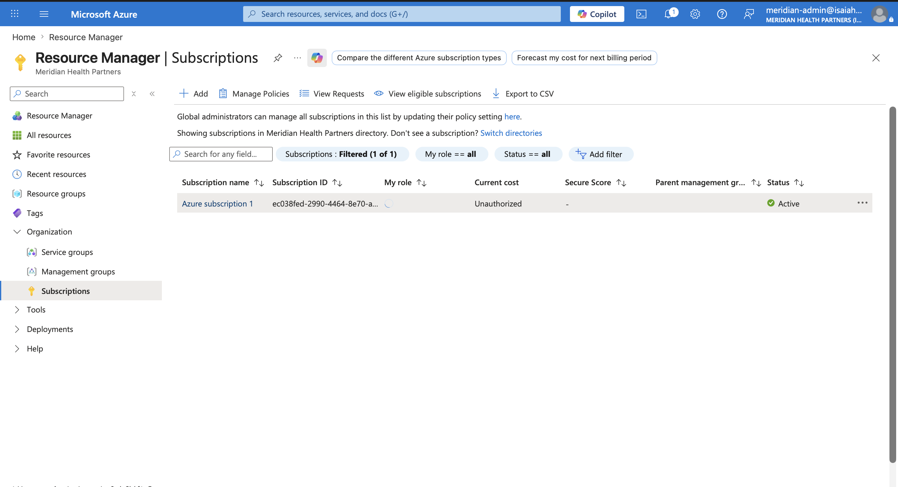

> The subscription is **Active**, but "My role" reads **Unauthorized**. Directory power ≠ resource power.

The fix is a deliberate, opt-in, logged elevation (covered in [Section 4](#4-bootstrapping-access--the-elevation-saga)) — which is itself a least-privilege design choice by Microsoft.

---

## 3. Architecture Overview

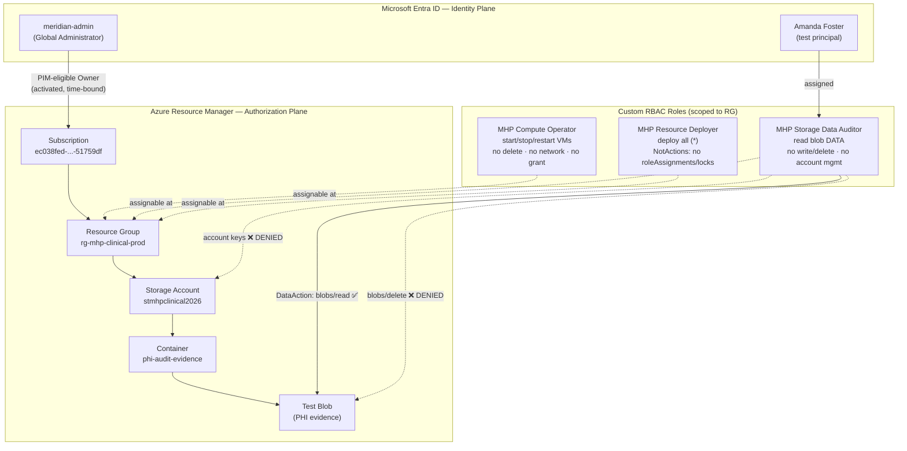
```mermaid
graph TD
    subgraph Identity["Microsoft Entra ID — Identity Plane"]
        GA["meridian-admin<br/>(Global Administrator)"]
        AF["Amanda Foster<br/>(test principal)"]
    end

    subgraph ARM["Azure Resource Manager — Authorization Plane"]
        SUB["Subscription<br/>ec038fed-...-51759df"]
        RG["Resource Group<br/>rg-mhp-clinical-prod"]
        SA["Storage Account<br/>stmhpclinical2026"]
        CON["Container<br/>phi-audit-evidence"]
        BLOB["Test Blob<br/>(PHI evidence)"]
    end

    subgraph Roles["Custom RBAC Roles (scoped to RG)"]
        R1["MHP Compute Operator<br/>start/stop/restart VMs<br/>no delete · no network · no grant"]
        R2["MHP Storage Data Auditor<br/>read blob DATA<br/>no write/delete · no account mgmt"]
        R3["MHP Resource Deployer<br/>deploy all (*)<br/>NotActions: no roleAssignments/locks"]
    end

    GA -->|"PIM-eligible Owner<br/>(activated, time-bound)"| SUB
    SUB --> RG
    RG --> SA
    SA --> CON
    CON --> BLOB

    R1 -.assignable at.-> RG
    R2 -.assignable at.-> RG
    R3 -.assignable at.-> RG

    AF -->|assigned| R2
    R2 -->|"DataAction: blobs/read ✅"| BLOB
    R2 -.->|"blobs/delete ❌ DENIED"| BLOB
    R2 -.->|"account keys ❌ DENIED"| SA
```

**Design choices encoded in the diagram:**

- All three roles are **scoped to the resource group**, not the subscription. A role's `assignableScopes` defines *where it can be assigned* — locking it to the RG means it can never be handed out subscription-wide, baking least privilege into the definition itself.
- Owner was held as a **PIM-eligible, time-bound** assignment, not standing — zero standing privilege in practice.
- The validation path (Amanda → Storage Data Auditor → read allowed, delete/keys denied) proves the control/data-plane wall behaves as designed.

---

## 4. Bootstrapping Access — The Elevation Saga

Before any role could be built, the admin account needed real Azure RBAC authority on the subscription. This section is documented in full because the **elevate → activate → use → de-elevate** arc *is* half the learning, and it surfaced three genuine troubleshooting moments.

### 4.1 The empty subscription

The subscription's **Access control (IAM) → Role assignments** showed **No results** — confirming the "Unauthorized" status. There were literally zero RBAC assignments on it.

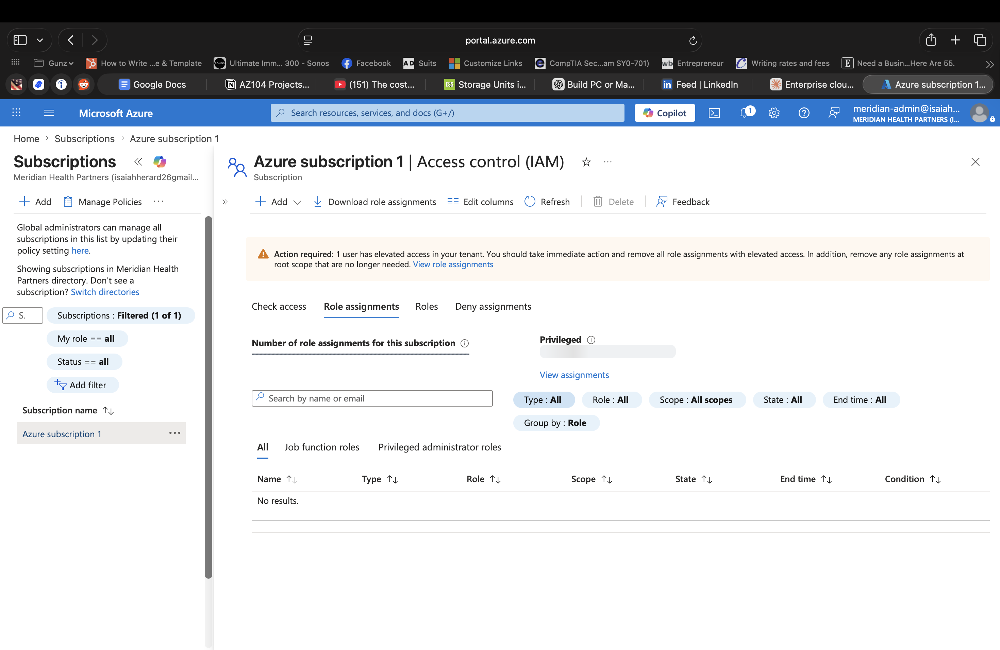

### 4.2 Root-scope elevation toggle

A Global Administrator can grant themselves **User Access Administrator at the root scope (`/`)** via a deliberate toggle in **Entra ID → Properties → Access management for Azure resources**. Root scope sits *above* every subscription and management group; this is the bootstrap mechanism that lets you assign the first real role.

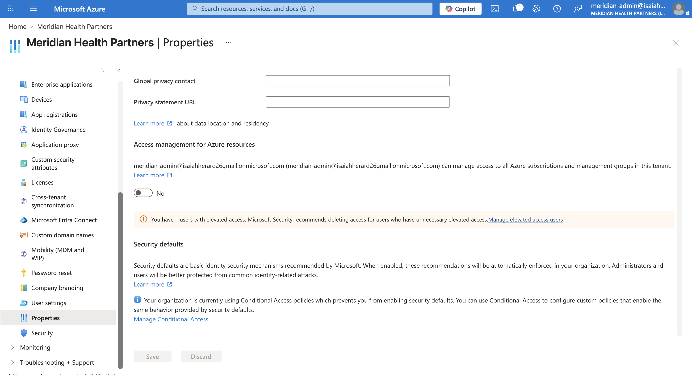

The toggle is **opt-in and logged on purpose** — Microsoft's own least-privilege design. We flipped it to **Yes** and saved to obtain the root assignment.

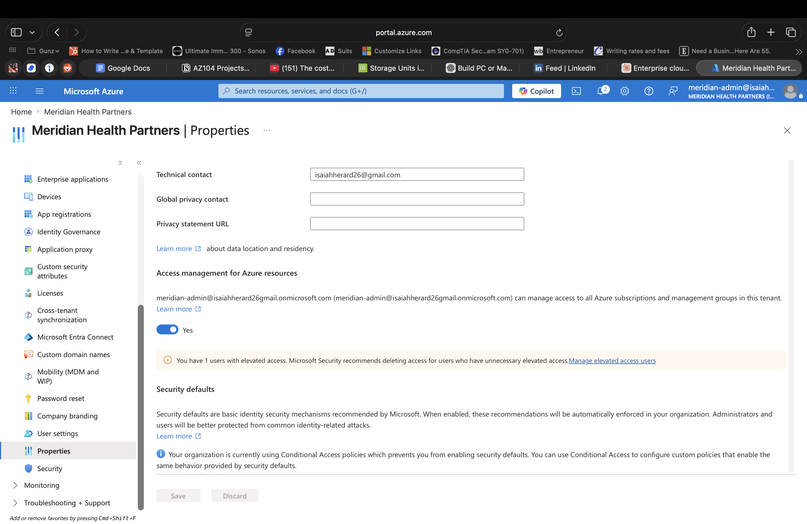

> **Interview note:** root-scope User Access Administrator only lets you *assign* roles. It is not itself a working role on the subscription — you still have to grant yourself something usable (Owner) at a real scope.

### 4.3 The PIM eligible-vs-active wall

After elevating, the Owner assignment for the admin account showed state **"Eligible, time-bound"** — not Active.

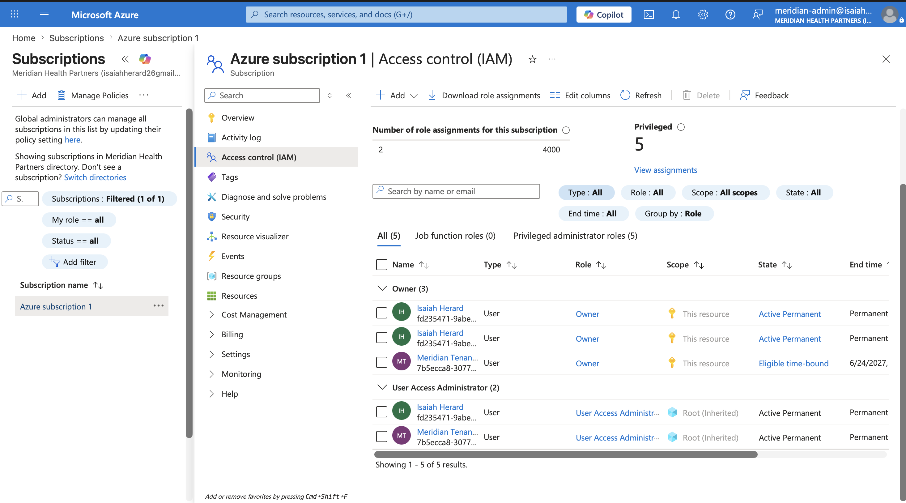

This is **Microsoft Entra Privileged Identity Management (PIM)**. An **eligible** assignment means you *can become* Owner but *aren't right now* — you must **activate** it for a limited window before the permissions land in your token. Until activation, the role grants nothing.

> This is the same eligible-vs-active mechanism encountered earlier in the portfolio (PIM blocking a user in the PAM/PIM project) — now experienced from the admin side. **An eligible-but-not-active Owner is zero standing privilege in action.**

Activation went through **PIM → My roles → Azure resources → Activate**, with a justification reason and a time-bound duration.

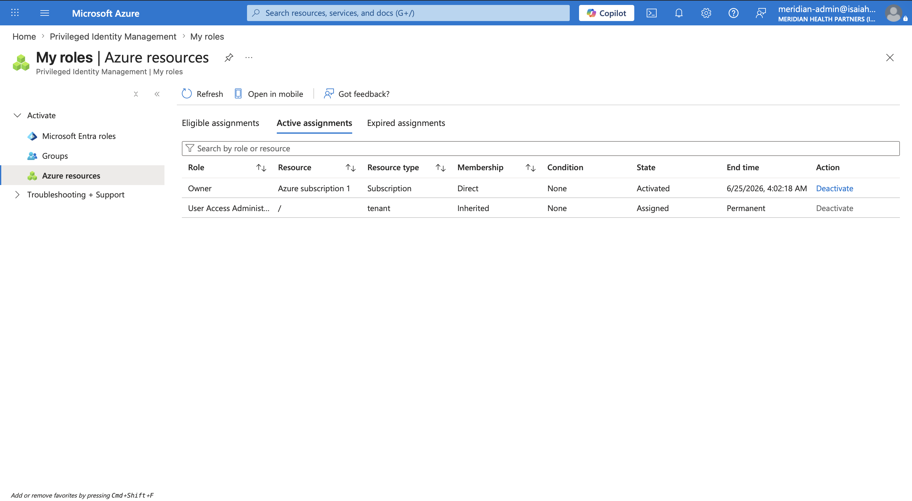

### 4.4 Confirming working access via a real action

The proof that elevation + activation worked was simply creating the resource group that anchors the whole project.

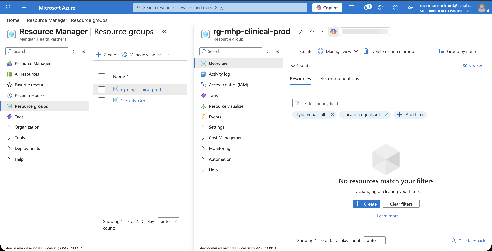

**Naming convention** (signals environment and data sensitivity for auditors):
`rg-` (resource group) · `mhp` (org) · `clinical-prod` (production clinical/PHI workload — the HIPAA-relevant boundary).

*(Bootstrap screenshots `05-owner-assignment-confirmed.png` capture the interim Owner-grant step.)*

---

## 5. Custom Role 1 — MHP Compute Operator (Least Privilege)

**Named problem:** MHP's operations team (e.g., senior sysadmin Robert Kim) needs to start, stop, and restart VMs during daily operations and patch windows. They must **not** be able to create, delete, or resize VMs, touch networking, or grant access.

**Why the built-in fails:** *Virtual Machine Contributor* is the closest fit and is too broad — it can create and delete VMs and manage their disks.

### Construction philosophy: deny-by-default, add only what's needed

This role lists *exactly* the permissions required and nothing else.

### Build process

Custom role creation launched from inside the resource group (which pre-populates `assignableScopes` to the RG — least-privilege scoping by default).

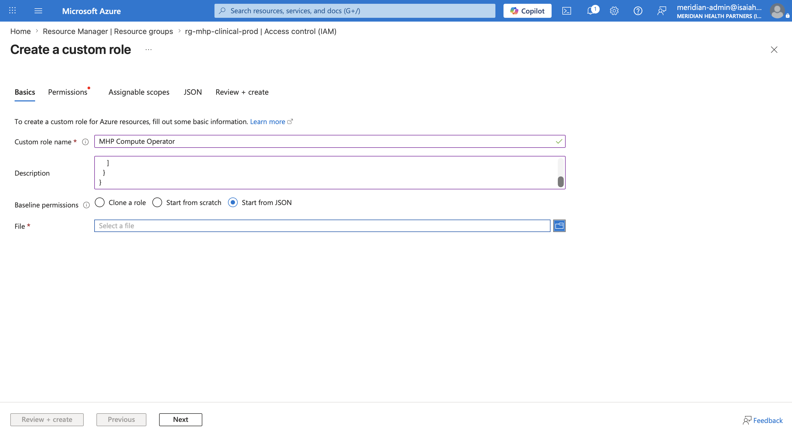
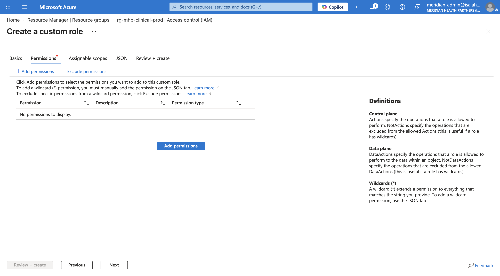
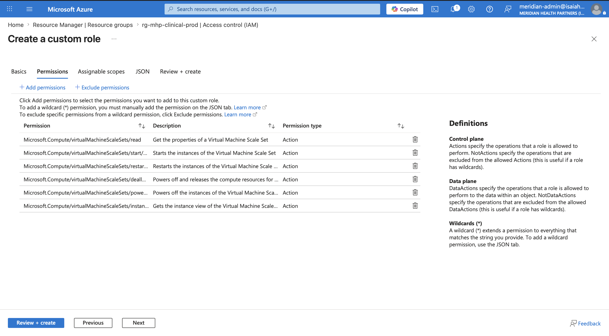

### The defect that was caught (and why it matters)

Reviewing the generated JSON *before* creating revealed that the permission picker had selected **`virtualMachineScaleSets`** actions instead of **`virtualMachines`**. Scale Sets are a different resource type (auto-scaling VM fleets); the role as generated would have had **zero power over individual VMs** and been silently useless.

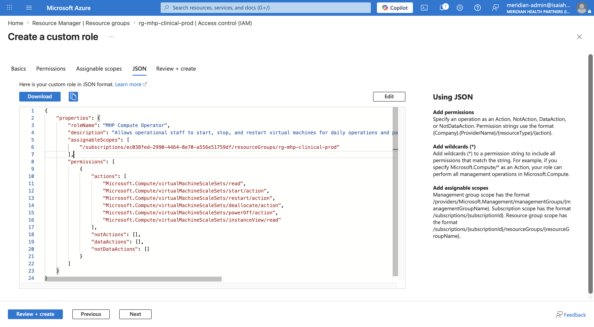

This was caught only by **reading the raw JSON rather than trusting the picker's friendly names** ("Start Virtual Machine Scale Set" vs "Start Virtual Machine" look nearly identical). The fix also added the missing `Microsoft.Resources/subscriptions/resourceGroups/read` (it lives under a different provider, so the Compute-only picker pass never grabbed it).

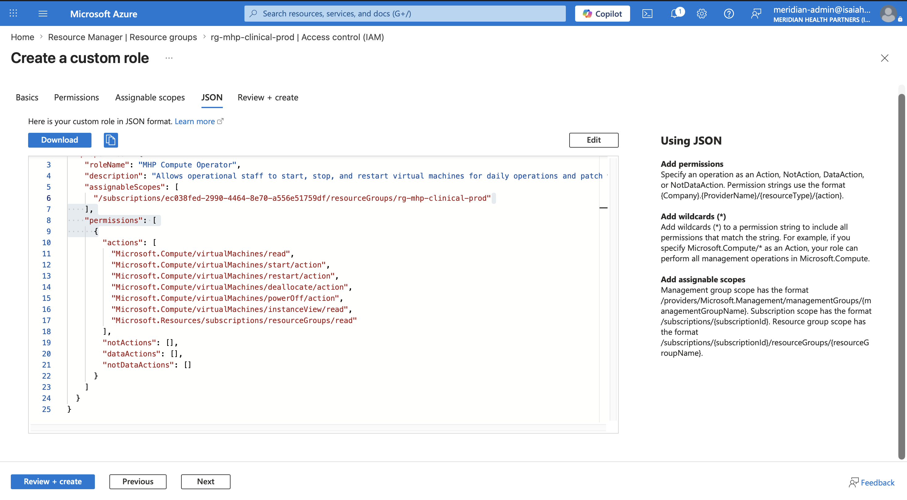

### Final role definition

```json
{
  "properties": {
    "roleName": "MHP Compute Operator",
    "description": "Allows operational staff to start, stop, and restart virtual machines for daily operations and patch windows. Cannot create, delete, resize, or modify networking. Scoped to clinical production resource group.",
    "assignableScopes": [
      "/subscriptions/ec038fed-2990-4464-8e70-a556e51759df/resourceGroups/rg-mhp-clinical-prod"
    ],
    "permissions": [
      {
        "actions": [
          "Microsoft.Compute/virtualMachines/read",
          "Microsoft.Compute/virtualMachines/start/action",
          "Microsoft.Compute/virtualMachines/restart/action",
          "Microsoft.Compute/virtualMachines/deallocate/action",
          "Microsoft.Compute/virtualMachines/powerOff/action",
          "Microsoft.Compute/virtualMachines/instanceView/read",
          "Microsoft.Resources/subscriptions/resourceGroups/read"
        ],
        "notActions": [],
        "dataActions": [],
        "notDataActions": []
      }
    ]
  }
}
```

### Why each action is present

| Action | Why |
|---|---|
| `virtualMachines/read` | You can't operate a VM you can't see. Read is the floor. |
| `virtualMachines/start/action` | Core job — power on. |
| `virtualMachines/restart/action` | Core job — reboot for patching. |
| `virtualMachines/deallocate/action` | Stops the VM **and releases compute hardware → stops compute billing**. |
| `virtualMachines/powerOff/action` | Stops the OS but the VM stays **allocated → you keep paying**. A real ops role needs both for cost-conscious shutdowns. |
| `virtualMachines/instanceView/read` | Lets the operator see **power state** (running/stopped). Without it they're flying blind on whether a start worked. |
| `subscriptions/resourceGroups/read` | So the RG is visible in the portal; otherwise navigation breaks. |

### Deliberate omissions (the least-privilege story)

- No `/write` → cannot create or resize VMs
- No `/delete` → cannot destroy VMs
- Nothing under `Microsoft.Network/*` → cannot touch NICs, NSGs, subnets
- Nothing under `Microsoft.Authorization/*` → **cannot grant access (no privilege escalation)**
- **No wildcards.** Explicit verbs only — the picker offered `virtualMachines/*` and it was deliberately *not* selected, because a wildcard would silently include write and delete.

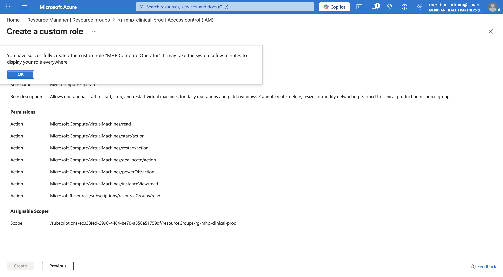

---

## 6. Custom Role 2 — MHP Storage Data Auditor (Control/Data Plane Separation)

This is the role that demonstrates cloud IAM fluency most candidates lack.

**Named problem:** MHP's compliance auditors (e.g., finance/compliance analyst Amanda Foster) must **read the actual contents of PHI blobs** as audit evidence. They must **not** modify, delete, or upload anything (evidence integrity), and must **not** manage the storage account itself (no key rotation, no network changes, no deletion).

### Why built-in roles fail — the control/data plane wall

- **Reader** (control plane) shows the account exists and its config, but grants **zero** ability to read blob *data*. An auditor with Reader sees an empty-looking container.
- **Contributor / Storage Account Contributor** can *manage* the account (keys, config, deletion) but — surprisingly — **also cannot read blob data by default**. Managing the container is control plane; reading the bytes inside is *data plane*, and they are walled off.
- **Storage Blob Data Reader** (built-in) *does* grant data-plane read and is close to what we want.

**Why build a custom role anyway?** (1) to compose the role deliberately from `DataActions` rather than trusting a built-in, and (2) so the role's *purpose* is self-documenting in access reviews — a role literally named "Storage Data Auditor" tells the audit story better than a generic built-in.

### The key concept: `Actions` vs `DataActions`

- **`Actions`** = control-plane operations (managing the resource: see it, list containers).
- **`DataActions`** = operations on the **data inside** the resource (reading the actual blob bytes).

They are evaluated by **different parts of Azure**. This separation is the entire HIPAA "minimum necessary" enforcement mechanism: you can grant data access **independently** of management access.

### Final role definition

```json
{
  "properties": {
    "roleName": "MHP Storage Data Auditor",
    "description": "Allows compliance auditors to read blob data as audit evidence within the clinical production storage account. Read-only at the data plane; cannot write, delete, or manage the storage account. Scoped to clinical production resource group.",
    "assignableScopes": [
      "/subscriptions/ec038fed-2990-4464-8e70-a556e51759df/resourceGroups/rg-mhp-clinical-prod"
    ],
    "permissions": [
      {
        "actions": [
          "Microsoft.Storage/storageAccounts/read",
          "Microsoft.Storage/storageAccounts/blobServices/containers/read",
          "Microsoft.Resources/subscriptions/resourceGroups/read"
        ],
        "notActions": [],
        "dataActions": [
          "Microsoft.Storage/storageAccounts/blobServices/containers/blobs/read"
        ],
        "notDataActions": []
      }
    ]
  }
}
```

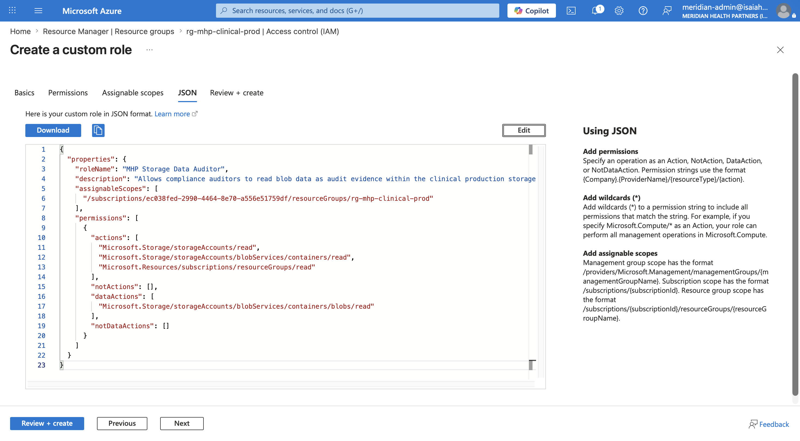

### The split, explained

**Control plane (`Actions`):**
- `storageAccounts/read` — see the account exists.
- `blobServices/containers/read` — see/list the containers. (Lists container *names*, not blob *contents*.)
- `subscriptions/resourceGroups/read` — see the RG in the portal.

**Data plane (`DataActions`) — the line that matters:**
- `blobServices/containers/blobs/read` — **read the actual bytes of the blobs.** No built-in control-plane role grants this.

### Deliberate omissions

- No `blobs/write` or `blobs/delete` → **cannot alter or destroy evidence** (integrity).
- No `storageAccounts/write` or `/delete` → cannot manage or destroy the account.
- **No `listKeys/action`** → cannot grab account keys and bypass RBAC entirely. *This is a classic privilege-escalation path auditors specifically check for — omitting it forces all access through Azure AD / RBAC.*

Azure's own review panel correctly classified the blob-read line as a **DataAction** (not an Action), confirming the plane split landed.

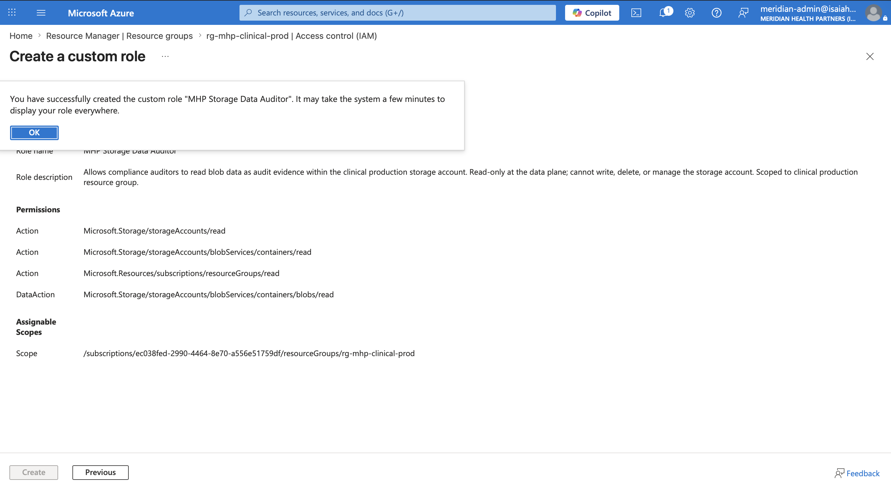

---

## 7. Custom Role 3 — MHP Resource Deployer (Separation of Duties)

The capstone — where `NotActions` finally does real work.

**Named problem:** MHP has a deployment/automation function that must **create and manage resources broadly** in the clinical RG, but must be **structurally prevented from granting access to anyone, including itself.**

**The toxic combination being prevented:** "can deploy resources" **+** "can assign roles" = self-escalation. If one identity holds both, it can deploy a resource and then grant itself (or a colluding account) elevated rights on it — a textbook separation-of-duties violation.

### Construction philosophy: allow-broad, subtract-the-dangerous

This role is the **inverse** of roles 1 and 2. Instead of "deny by default, add what's needed," it grants `*` (all actions in the RG) and then **subtracts** the dangerous permissions via `NotActions`.

> **`NotActions` is not a deny.** It is a *subtraction* from `Actions`. If a **different** role grants the user one of these permissions, they still get it. `NotActions` removes the permission *from this role's grant* — it is not an explicit deny rule. (Explicit denies are a separate Azure feature called **deny assignments**.)

### Final role definition

```json
{
  "properties": {
    "roleName": "MHP Resource Deployer",
    "description": "Allows deployment and management of resources within the clinical production resource group, but explicitly cannot manage access assignments, role definitions, or locks. Prevents privilege self-escalation. Scoped to clinical production resource group.",
    "assignableScopes": [
      "/subscriptions/ec038fed-2990-4464-8e70-a556e51759df/resourceGroups/rg-mhp-clinical-prod"
    ],
    "permissions": [
      {
        "actions": [
          "*"
        ],
        "notActions": [
          "Microsoft.Authorization/roleAssignments/write",
          "Microsoft.Authorization/roleAssignments/delete",
          "Microsoft.Authorization/roleDefinitions/write",
          "Microsoft.Authorization/roleDefinitions/delete",
          "Microsoft.Authorization/locks/write",
          "Microsoft.Authorization/locks/delete"
        ],
        "dataActions": [],
        "notDataActions": []
      }
    ]
  }
}
```

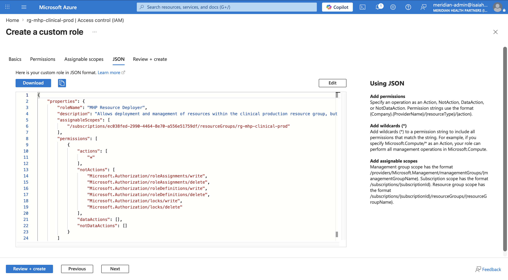

### Why each carve-out is in `NotActions`

| Subtracted permission | Why |
|---|---|
| `roleAssignments/write` & `/delete` | **The core SoD control.** Without these, the deployer cannot grant *any* role to *anyone* — no self-escalation, no granting a buddy access. |
| `roleDefinitions/write` & `/delete` | Cannot create or alter custom roles either — otherwise they could craft a malicious role for later use. Belt-and-suspenders with the above. |
| `locks/write` & `/delete` | Cannot remove resource locks. Locks guard against accidental/malicious deletion; stripping them would bypass a key safety control. Keeping lock management in another role is another SoD boundary. |

### Honest scoping note

`Actions: ["*"]` scoped to a resource group is still powerful — it is *everything-except-authorization within that RG*. In a tighter real-world design you might enumerate specific resource providers instead of `*`. The breadth-minus-danger model was chosen deliberately for the "deployer" archetype; a more restrictive variant would enumerate providers explicitly. Documenting the tradeoff and its alternative is part of designing roles like an engineer rather than clicking through a lab.

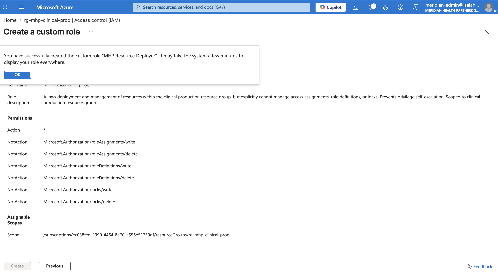

### Two construction philosophies, side by side

| | Roles 1 & 2 (Operator, Auditor) | Role 3 (Deployer) |
|---|---|---|
| Approach | Deny by default, add only what's needed | Allow broadly, subtract what's dangerous |
| Mechanism | Explicit `Actions` / `DataActions` | `Actions: *` + `NotActions` |
| Best for | Narrow, well-defined job functions | Broad jobs where enumeration is impractical |

---

## 8. Validation — Proving the Boundaries Hold

Building a role proves nothing. **Testing that the deny actually fires** is what separates a real engineering artifact from a configuration screenshot. The Storage Data Auditor was chosen for validation because its boundary (can read data, cannot delete it; cannot manage the account) is the most demonstrative.

### Test fixtures

A storage account and a private container with a test blob were created to give the auditor something real to read.

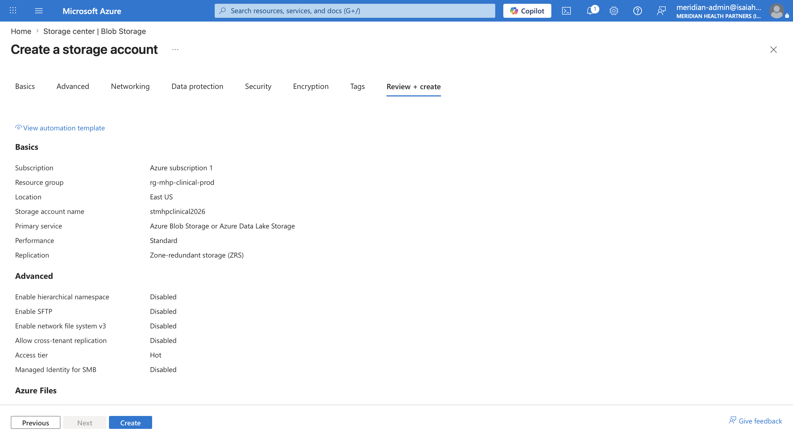

- **Account:** `stmhpclinical2026` — `st` prefix is the Azure naming convention for storage accounts.
- **Container:** `phi-audit-evidence` — **Private (no anonymous access)**, so the *only* way in is RBAC/Azure AD auth — exactly the access path the custom role governs. A public container would make the test meaningless.

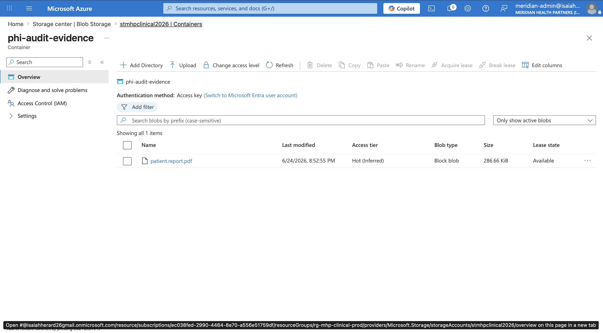

> **Note:** `stmhpclinical2026` is the **storage account name**. The long timestamped string Azure showed (`stmhpclinical2026_178235...`) was the **deployment name** — every portal resource creation kicks off an ARM *deployment* with its own timestamped label, separate from the resource it produces.

### Role assignment to a test principal

The Storage Data Auditor role was assigned to **Amanda Foster** at the resource group scope.

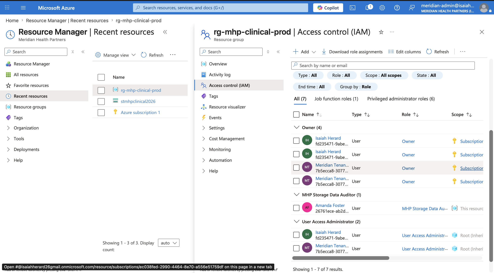

> **This grouped Role-assignments view *is* what an access review looks like.** When an auditor asks "who can read PHI evidence," the purpose-named custom role answers it instantly. The same screenshot also exposed standing **User Access Administrator at Root (Inherited)** — flagged for cleanup in [Section 9](#9-de-elevation--closing-the-zero-standing-privilege-loop).

To act *as* Amanda, her password was reset (Azure issues a temporary password forcing a change at first login).

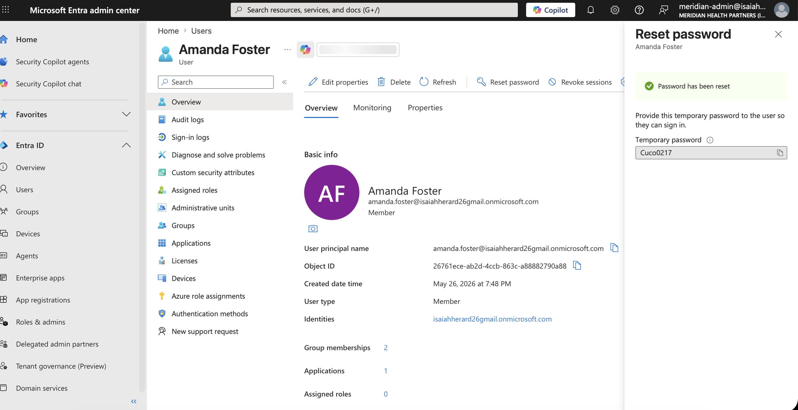

### The three tests (signed in as Amanda, in a private browser session)

**Test 1 — control-plane management DENY ✅**
Amanda can *see* the storage account but is denied when attempting to open **Access Keys** — she has no management write and no `listKeys`. She cannot administer the account.

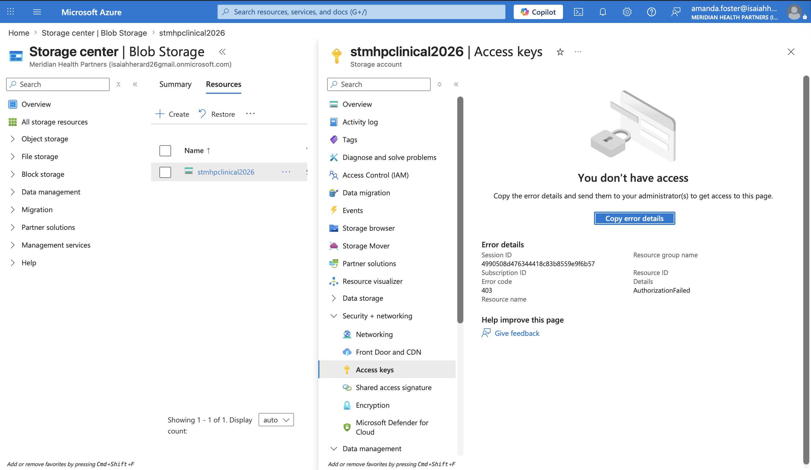

**Test 2 — data-plane read ALLOW ✅**
Amanda opens the test blob and reads its contents — her `blobs/read` DataAction works. This is the "minimum necessary" read access functioning. *(Reached via **Storage browser**, which forces Entra-auth evaluation — see Troubleshooting #8.)*

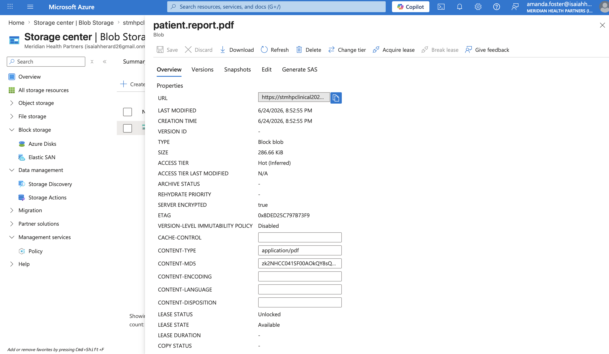

**Test 3 — data-plane write/delete DENY ✅ (the money shot)**
Amanda attempts to delete the blob and is denied with an authorization error — she has read but not write/delete at the data plane. **Evidence integrity proven: an auditor can read evidence but cannot alter or destroy it.**

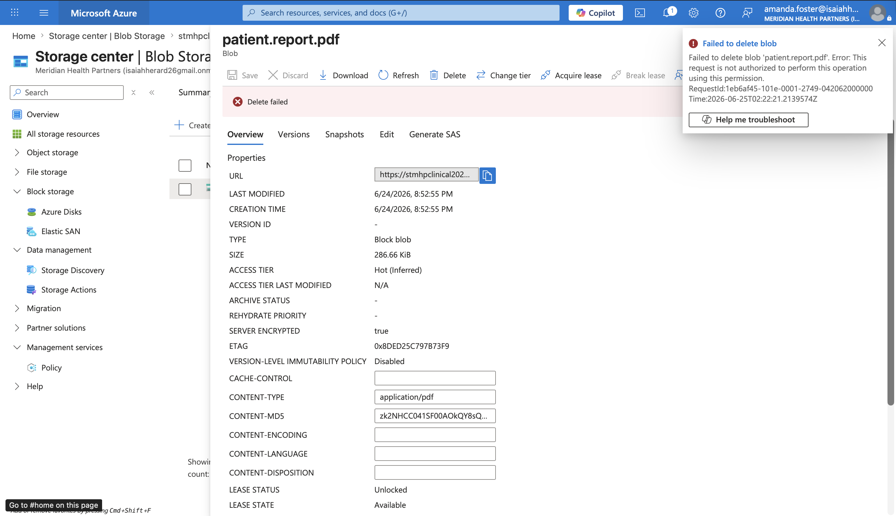

**Result:** the control/data-plane design behaves exactly as written. Read works, delete and account management are denied. The deny fires.

---

## 9. De-elevation — Closing the Zero-Standing-Privilege Loop

The root-scope **User Access Administrator** granted during bootstrap (Section 4) is standing privilege at the highest possible scope — exactly the anti-pattern a zero-standing-privilege program exists to eliminate. It was removed using **belt-and-suspenders cleanup**.

**Step 1 — turn off the elevation toggle.** Set **Entra ID → Properties → Access management for Azure resources** back to **No** and save. This stops the account from re-granting itself root access without a deliberate re-enable.

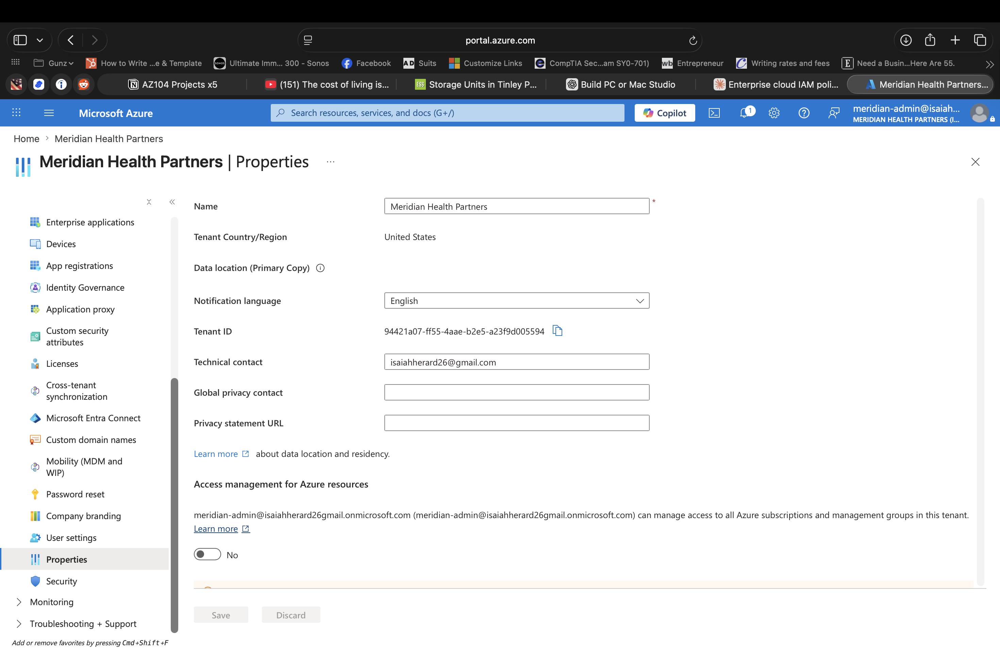

**Step 2 — remove the existing root assignment via Azure CLI (Cloud Shell).** The toggle going to No does not always auto-remove the existing assignment, so it was explicitly deleted:

```bash
# List the root-scope elevated assignment
az role assignment list --scope "/" --role "User Access Administrator" --output table

# Remove it (assignee fully quoted — the #EXT# guest UPN breaks bash unquoted)
az role assignment delete \
  --role "User Access Administrator" \
  --scope "/" \
  --assignee "isaiahherard26_gmail.com#EXT#@isaiahherard26gmail.onmicrosoft.com"

# Verify — should return an empty list
az role assignment list --scope "/" --role "User Access Administrator" --output table
```

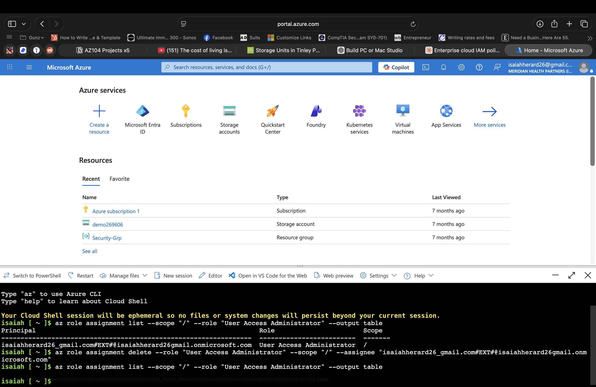

**Result:** root User Access Administrator removed; the **subscription Owner** (PIM-eligible) remains intact for legitimate work. The full arc — **elevate → activate (PIM) → use → de-elevate** — models zero standing privilege end to end.

---

## 10. Troubleshooting Log

Real failures, documented honestly as competence signals.

| # | Symptom | Root Cause | Resolution | Lesson |
|---|---|---|---|---|
| 1 | Subscription showed **"Unauthorized"** despite Global Admin login | Global Admin is an **Entra (identity-plane)** role; it grants no **Azure RBAC** rights on resources | Bootstrap elevation at root scope | Directory power ≠ resource power |
| 2 | **"Add role assignment" greyed out** | Root-scope elevation toggle was off; current token didn't carry User Access Administrator | Flipped Entra access-management toggle to Yes, saved, re-logged | RBAC changes only land in the token on a fresh sign-in |
| 3 | Owner assignment showed **"Eligible, time-bound"** | The Owner role was a **PIM-eligible** assignment, not active | Activated via PIM (My roles → Azure resources) with justification | Eligible ≠ active — must activate before permissions apply |
| 4 | **Resource group creation denied** ("you do not have permissions") | Token predated the PIM activation; Owner not yet effective | Activated Owner via PIM, retried | Same token-refresh lesson, data side |
| 5 | "Start from JSON" custom-role path was fussy (expects a file upload, overwrote Basics fields) | The JSON-upload route requires an actual `.json` file and is picky about the `properties` wrapper | Switched to **Start from scratch**, then edited the JSON tab directly | Know the portal's two custom-role paths and when each is cleaner |
| 6 | Compute role had **`virtualMachineScaleSets`** instead of **`virtualMachines`** | Picker friendly names ("Start Virtual Machine Scale Set" vs "Start Virtual Machine") look near-identical and sort adjacently | Caught by **reading the raw JSON**, corrected via Edit | Verify the generated policy, never trust UI labels |
| 7 | Missing `resourceGroups/read` after the Compute picker pass | That action lives under a **different provider** (`Microsoft.Resources`), not Compute | Added in the JSON edit | Permissions span providers — a single-provider picker pass misses cross-provider needs |
| 8 | Amanda got **"no access"** on the Containers blade | Role assignment hadn't propagated into her token yet; portal container browser also probes for `listKeys` (which she lacks) and can throw a blanket error | Full sign-out / sign-in (propagation), then used **Storage browser** to force Entra-auth evaluation | Data-plane RBAC changes propagate on a delay; Storage browser is the reliable Entra-auth test path |
| 9 | `az role assignment delete` → **"syntax error near unexpected token"** | Ran with the literal placeholder `<your-object-id>`; `<` `>` are shell redirects, and the `#EXT#` guest UPN also needs quoting | Replaced placeholder with the real UPN, wrapped in double quotes | Quote guest/external UPNs (`#EXT#`, `#`) in bash; never run placeholder text literally |

---

## 11. Interview Prep — Self-Quiz Q&A

Cover the answers and quiz yourself. Each maps to something built in this project.

**Q1. What's the difference between Entra ID roles and Azure RBAC roles?**
Entra roles govern the **directory/identity plane** (users, groups, app registrations, tenant settings — e.g., Global Administrator). Azure RBAC roles govern **Azure resources** via ARM (subscriptions, resource groups, VMs, storage — e.g., Owner, Contributor, custom roles). They are separate systems; being a Global Admin grants no Azure resource permissions.

**Q2. A Contributor on a storage account complains they can't read the blobs. Why?**
Managing the account is a **control-plane** right; reading blob bytes is a **data-plane** right (`DataActions`). Contributor grants control-plane management but no data-plane read by default. They need a data-plane role like Storage Blob Data Reader (or a custom role with `blobServices/containers/blobs/read` in `DataActions`).

**Q3. What are `Actions`, `NotActions`, `DataActions`, `NotDataActions`?**
`Actions` = allowed control-plane operations. `NotActions` = operations **subtracted** from `Actions` (not a deny — if another role grants it, the user keeps it). `DataActions` = allowed data-plane operations (on the data inside a resource). `NotDataActions` = subtractions from `DataActions`.

**Q4. Is `NotActions` a deny rule?**
No. It's a subtraction from this role's own grant. True explicit denies are **deny assignments**, a separate feature that overrides allow grants.

**Q5. What does `assignableScopes` control, and why scope a custom role to a resource group?**
It defines *where the role can be assigned*. Scoping to the RG means the role can never be assigned subscription-wide — least privilege and blast-radius control baked into the definition.

**Q6. Difference between `powerOff` and `deallocate` on a VM?**
`powerOff` stops the OS but the VM stays **allocated** — you keep paying for compute. `deallocate` releases the underlying hardware — compute billing stops (you still pay for disks). A real ops role needs both.

**Q7. Why omit `listKeys` from the auditor role?**
Storage account keys bypass RBAC entirely — anyone with the keys has full data access regardless of role. Omitting `listKeys` forces all access through Azure AD/RBAC, which is auditable and revocable. It closes a common privilege-escalation path.

**Q8. What's PIM, and what's the difference between eligible and active?**
Privileged Identity Management provides **just-in-time** role activation. An **eligible** assignment means a user *can activate* the role for a time-bound window with justification; until activated it grants nothing. An **active** assignment is in effect now. Eligible assignments are zero standing privilege.

**Q9. How does the Resource Deployer role prevent privilege escalation?**
It grants `Actions: *` (broad deploy) but subtracts `Microsoft.Authorization/roleAssignments/write` and `/delete` via `NotActions`, so the holder can deploy resources but cannot grant any role to anyone — including themselves. That breaks the "deploy + assign" toxic combination at the role-definition level.

**Q10. You created a custom role and the assignee can't do the thing it should allow. First checks?**
(1) Has the assignment **propagated** and is it in the user's **token** (re-login)? (2) Is it **control vs data plane** — is the permission in the right array? (3) Is the **scope** correct? (4) Read the **raw JSON** of the role to confirm the exact action strings (watch for `virtualMachines` vs `virtualMachineScaleSets`-style mismatches).

**Q11. Why test a role instead of just creating it?**
Creation proves configuration; testing proves *behavior*. Demonstrating that the deny actually fires (Amanda reads the blob but is denied delete and key access) is concrete evidence the boundary holds — far stronger than "I made a role."

**Q12. How would you bootstrap Azure access for a fresh tenant where the Global Admin shows "Unauthorized" on the subscription?**
Elevate the Global Admin to **User Access Administrator at root scope** via Entra Properties → Access management toggle, re-login so the token carries it, assign a real working role (Owner) at the subscription/RG scope, then **de-elevate** by removing the root assignment afterward to avoid standing privilege.

**Q13. Two ways to build a least-privilege custom role — when do you use each?**
**Enumerate** (`Actions` listing exact verbs) for narrow, well-defined jobs (operator, auditor). **Subtract** (`Actions: *` + `NotActions`) for broad jobs where enumerating everything is impractical, carving out only the dangerous permissions (deployer). The first is tighter; the second is pragmatic for broad roles.

**Q14. How do custom roles support audit readiness / HIPAA minimum necessary?**
Purpose-named roles scoped tightly make access reviews self-documenting (a role called "Storage Data Auditor" explains itself in the IAM view), and the control/data-plane split lets you grant exactly the data access a job needs without bundling in management rights — directly expressing minimum necessary.

---

## 12. Concepts & Techniques Glossary

- **Control plane vs data plane** — managing a resource (control) vs operating on the data inside it (data). Governed by `Actions` and `DataActions` respectively; evaluated separately by Azure.
- **`assignableScopes`** — where a role definition is allowed to be assigned. Scoping to a resource group prevents subscription-wide assignment.
- **Root scope (`/`)** — the top of the Azure hierarchy, above all management groups and subscriptions. User Access Administrator here is the bootstrap elevation point.
- **PIM (Privileged Identity Management)** — just-in-time, time-bound role activation. Eligible (can activate) vs Active (in effect now).
- **Zero standing privilege** — no one holds elevated access continuously; rights are activated when needed and removed after. Modeled here by PIM-eligible Owner + root de-elevation.
- **Separation of duties (SoD)** — splitting powers so no single identity can complete a sensitive end-to-end action alone (e.g., deploy *and* grant access). Enforced via `NotActions` on the Deployer role.
- **Deny assignment vs `NotActions`** — a deny assignment explicitly blocks an action regardless of other grants; `NotActions` merely subtracts from one role's grant.
- **Resource provider** — the Azure service namespace for permissions (`Microsoft.Compute`, `Microsoft.Storage`, `Microsoft.Resources`, `Microsoft.Authorization`). Permissions for one job can span multiple providers.
- **Deployment vs resource** — every portal creation runs an ARM **deployment** (timestamped operation) that produces the **resource**; the two have different names.
- **Token refresh** — Azure RBAC changes land in a user's access token on the next sign-in; existing sessions may not reflect a new assignment until re-auth.

---

## 13. Skills Demonstrated

- **Azure RBAC custom role design** — three production-style roles from JSON, scoped to least privilege
- **Control-plane / data-plane separation** — the core cloud IAM competency, applied to PHI data access
- **Separation of duties** — self-escalation prevention via `NotActions`
- **Privileged access bootstrapping** — root elevation, PIM activation, deliberate de-elevation
- **Zero standing privilege** — PIM-eligible roles + root cleanup
- **Validation engineering** — proving allow *and* deny behavior with a test principal
- **Azure CLI** — RBAC inspection and cleanup via Cloud Shell
- **HIPAA-aligned access governance** — minimum necessary, audit-ready, purpose-named roles
- **Defensive policy review** — caught a silent resource-type defect by reading raw JSON

---

*Portfolio project for IAM Analyst roles · Meridian Health Partners is a fictional organization used consistently across this portfolio for HIPAA-relevant scenario framing.*
